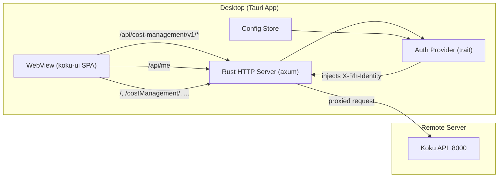

# Cost Management Desktop Client

A lightweight [Tauri v2](https://v2.tauri.app/) desktop application that provides a native desktop experience for [Red Hat Cost Management](https://github.com/project-koku/koku). It bundles the koku-ui on-prem frontend, runs a local HTTP proxy, and forwards API requests to a remote Koku backend server — so the koku-ui SPA works completely unmodified.

## Architecture

See [docs/architecture.md](docs/architecture.md) for the full design document.



The koku-ui SPA uses relative URLs for API calls. The desktop client runs a localhost HTTP server inside the Tauri process that:

1. **Serves static files** — the pre-built koku-ui on-prem assets
2. **Proxies `/api/`** — forwards API requests to the configured remote Koku server
3. **Injects auth headers** — adds `X-Rh-Identity` (dev mode) or `Authorization: Bearer` (OIDC)
4. **Mocks `/api/me`** — returns username/email for the toolbar display

## Prerequisites

### Rust

Rust 1.85+ is required (edition 2024). Install via [rustup](https://rustup.rs/):

```bash
curl --proto '=https' --tlsv1.2 -sSf https://sh.rustup.rs | sh
```

### Node.js (for UI build only)

Node.js 22+ and npm 11+ are required **only** for building koku-ui from source. If you use a pre-built UI archive, Node.js is not needed for the desktop client itself.

### System dependencies (Linux)

Tauri requires several system libraries. Install them first:

**Fedora / RHEL / CentOS Stream:**

```bash
sudo dnf install webkit2gtk4.1-devel openssl-devel curl wget file \
  libappindicator-gtk3-devel librsvg2-devel \
  gtk3-devel libxdo-devel
```

**Debian / Ubuntu:**

```bash
sudo apt install libwebkit2gtk-4.1-dev libgtk-3-dev \
  libayatana-appindicator3-dev librsvg2-dev \
  build-essential curl wget file libssl-dev
```

### Tauri CLI

Install the Tauri command-line tool:

```bash
cargo install tauri-cli
```

> **Troubleshooting:** If `cargo install tauri-cli` fails with a `time` crate conflict (`E0119`), pin the `time` crate first: add `time = "=0.3.47"` to `[dependencies]` in `src-tauri/Cargo.toml`, run the install, then remove the pin.

### Koku backend

You need access to a running Koku backend. For dev-mode authentication, the backend must be running with `DEVELOPMENT=True`.

---

## Quick Start

### 1. Clone the repository

```bash
git clone <repo-url> koku-desktop
cd koku-desktop
```

### 2. Build the UI assets

The `ui/` directory must contain the pre-built koku-ui on-prem static files. Build them from source:

```bash
./scripts/build-ui.sh
```

The script looks for the koku-ui repository in this order:

| Priority | Location |
|----------|----------|
| 1 | `$KOKU_UI_DIR` environment variable |
| 2 | `~/dev/koku/koku-ui` |
| 3 | `../koku-ui` (sibling directory) |

To point at a custom location:

```bash
KOKU_UI_DIR=/path/to/koku-ui ./scripts/build-ui.sh
```

Use `--clean` to remove the existing `ui/` directory before copying:

```bash
./scripts/build-ui.sh --clean
```

The script runs `npm ci` and `npm run build:onprem` inside the koku-ui repo, then copies four dist trees:

| Source | Destination | Content |
|--------|-------------|---------|
| `apps/koku-ui-onprem/dist/` | `ui/` | On-prem shell |
| `apps/koku-ui-hccm/dist/` | `ui/costManagement/` | HCCM (Cost Management) |
| `apps/koku-ui-ros/dist/` | `ui/costManagementRos/` | Resource Optimization (ROS) |
| `apps/koku-ui-sources/dist/` | `ui/sources/` | Sources plugin |

### 3. Run in development mode

```bash
cargo tauri dev
```

This compiles the Rust backend, starts the local proxy, and opens the desktop window. The Rust backend hot-reloads on source changes.

### 4. Configure on first launch

On first launch (no config file exists), the settings page opens automatically. Enter your Koku server URL (e.g., `http://192.168.1.50:8000`), choose the auth mode, and click **Save & Connect**.

---

## Building for Production

### Compile the release binary and packages

```bash
cargo tauri build
```

This produces:

| Output | Location |
|--------|----------|
| Binary | `src-tauri/target/release/koku-desktop` |
| RPM | `src-tauri/target/release/bundle/rpm/Cost Management Desktop-*.rpm` |
| DEB | `src-tauri/target/release/bundle/deb/Cost Management Desktop_*.deb` |
| AppImage | `src-tauri/target/release/bundle/appimage/Cost Management Desktop_*.AppImage` |

> **Note:** The actual `target/` directory may be redirected by `CARGO_BUILD_BUILD_DIR` or Cargo configuration. If using a sandbox or CI, check your Cargo configuration for the actual output path.

> **Note:** AppImage bundling requires `linuxdeploy` and may fail in sandboxed environments. RPM and DEB are more reliable.

### Build only the binary (no packages)

If you only want the binary without creating distribution packages:

```bash
cd src-tauri
cargo build --release
```

The binary will be at `src-tauri/target/release/koku-desktop` (or the configured `CARGO_BUILD_BUILD_DIR`).

### Run the release binary directly

```bash
./src-tauri/target/release/koku-desktop
```

### Install the RPM (Fedora/RHEL)

```bash
sudo rpm -i "src-tauri/target/release/bundle/rpm/Cost Management Desktop-0.1.0-1.x86_64.rpm"
```

### Install the DEB (Debian/Ubuntu)

```bash
sudo dpkg -i "src-tauri/target/release/bundle/deb/Cost Management Desktop_0.1.0_amd64.deb"
```

---

## Configuration

Settings are stored as JSON at the platform-standard config directory:

| Platform | Path |
|----------|------|
| Linux | `~/.config/koku-desktop/config.json` |
| macOS | `~/Library/Application Support/koku-desktop/config.json` |
| Windows | `%APPDATA%\koku-desktop\config.json` |

Example config:

```json
{
  "server_url": "http://192.168.1.50:8000",
  "auth_mode": "dev",
  "theme": "system",
  "modules": {
    "ros": true,
    "sources": true
  },
  "dev_identity": {
    "identity": {
      "account_number": "10001",
      "org_id": "1234567",
      "type": "User",
      "user": {
        "username": "admin",
        "email": "admin@example.com",
        "is_org_admin": true
      }
    },
    "entitlements": {
      "cost_management": { "is_entitled": true }
    }
  }
}
```

### Auth modes

| Mode | Header injected | Backend requirement |
|------|----------------|---------------------|
| `dev` | `X-Rh-Identity: <base64>` | `DEVELOPMENT=True` |
| `oidc` | `Authorization: Bearer <jwt>` | Keycloak + Envoy gateway |

### Theme options

| Value | Behavior |
|-------|----------|
| `"light"` | Always light theme |
| `"dark"` | Always dark theme |
| `"system"` | Follows OS `prefers-color-scheme` |

### Module toggling

Setting `modules.ros` or `modules.sources` to `false` causes the proxy to return 404 for that module's `plugin-manifest.json`, disabling it in the koku-ui SPA. HCCM is always enabled.

### Sensitive values

Secrets (e.g., Keycloak `client_secret`, OIDC tokens) are stored in the **OS keychain** (GNOME Keyring / KDE Wallet / macOS Keychain / Windows Credential Manager), not in the config file. The keychain service name is `koku-desktop`.

---

## Features

- **Unified titlebar** — File/Navigate/View/Help menus merged into the koku-ui masthead
- **Theme switching** — Light, dark, or system preference (View > Toggle Theme or Ctrl+T)
- **Navigation shortcuts** — Keyboard shortcuts for all Cost Management sections
- **Printing** — Native OS print dialog (Ctrl+P)
- **System tray** — Close-to-tray; restore or quit from the tray icon menu
- **File downloads** — CSV exports save to `~/Downloads` automatically
- **Module toggling** — Enable or disable ROS and Sources plugins via config
- **About window** — App version, OS info, build details, and connected server status (Help > About)
- **Window state persistence** — Remembers size, position, and maximized state across launches

### Keyboard shortcuts

| Shortcut | Action |
|----------|--------|
| Ctrl+H | Navigate to Overview |
| Ctrl+O | Navigate to OpenShift |
| Ctrl+E | Navigate to Cost Explorer |
| Ctrl+Shift+S | Navigate to CM Settings |
| Ctrl+T | Toggle light/dark theme |
| Ctrl+P | Print current page |
| Ctrl+Q | Quit application |

---

## Troubleshooting

### "Test Connection" fails or pages are blank

- Verify the Koku server is reachable from your machine (`curl http://<server>:8000/api/cost-management/v1/status/`)
- If using OIDC with a gateway, ensure the Keycloak realm is correct in your config
- If the server uses self-signed certificates, the app accepts them by default (`danger_accept_invalid_certs`)

### Pages show "This page is temporarily unavailable"

The API proxy can't reach the backend. Check your `server_url` in the config or settings page.

### Duplicate titlebar on GNOME/Wayland

On GNOME with Wayland, the compositor draws its own server-side decorations (titlebar with min/max/close buttons). This is a platform limitation — `decorations: false` is ignored. The app's unified titlebar (menus + user profile) works correctly below GNOME's native titlebar.

### AppImage build fails

AppImage bundling requires `linuxdeploy`, which may fail in sandboxed or restricted environments. RPM and DEB packages build reliably. The binary itself is always produced successfully.

### `cargo install tauri-cli` fails with E0119

This is a known conflict with the `time` crate. Temporarily pin it:

```bash
# Add to src-tauri/Cargo.toml [dependencies]:
# time = "=0.3.47"
cargo install tauri-cli
# Then remove the time pin from Cargo.toml
```

---

## License

Apache-2.0 — consistent with the [koku](https://github.com/project-koku/koku) project.

Fonts (Red Hat Display, Red Hat Text, Red Hat Mono) are licensed under the SIL Open Font License. See `fonts/LICENSE`.
