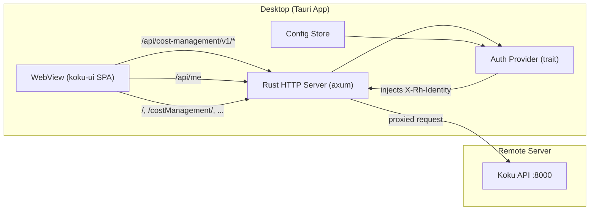

# Cost Management Desktop Client

## Overview

A lightweight Tauri v2 desktop application that provides a native desktop experience for Red Hat Cost Management (koku). It bundles the koku-ui on-prem frontend and proxies API requests to a remote Koku backend server.

## Architecture

See [docs/architecture.md](docs/architecture.md) for the full design document.



The koku-ui SPA uses relative URLs for API calls. The desktop client runs a localhost HTTP server inside the Tauri process that serves the pre-built UI assets, proxies `/api/` requests to your Koku server, and injects authentication headers—so the frontend works without modification.

## Prerequisites

- **Rust 1.77+** — [rustup](https://rustup.rs/) is recommended
- **Node.js 22+ and npm 11+** — required only for building koku-ui (see [Quick Start](#quick-start))
- **System dependencies for Tauri on Linux** (Fedora/RHEL example):

  ```bash
  sudo dnf install webkit2gtk4.1-devel openssl-devel curl wget file \
    libappindicator-gtk3-devel librsvg2-devel \
    gtk3-devel libxdo-devel
  ```

  On Debian/Ubuntu, the equivalent packages are typically `libwebkit2gtk-4.1-dev`, `libgtk-3-dev`, `libayatana-appindicator3-dev`, `librsvg2-dev`, and related build tools.

- **Access to a running Koku backend** with `DEVELOPMENT=True` (for dev-mode authentication via `X-Rh-Identity`)

## Quick Start

1. **Clone the repository**

   ```bash
   git clone <repo-url> koku-desktop
   cd koku-desktop
   ```

2. **Build the UI**

   From the project root, run the build script (executable after checkout):

   ```bash
   ./scripts/build-ui.sh
   ```

   The script looks for the koku-ui repository in this order:

   - `$KOKU_UI_DIR` (if set)
   - `~/dev/koku/koku-ui`
   - `../koku-ui` (relative to this repo)

   To point at a custom location:

   ```bash
   KOKU_UI_DIR=/path/to/koku-ui ./scripts/build-ui.sh
   ```

   Use `--clean` to remove the existing `ui/` directory before copying new build output.

3. **Install the Tauri CLI**

   ```bash
   cargo install tauri-cli
   ```

4. **Run in development mode**

   ```bash
   cargo tauri dev
   ```

5. **Configure on first launch**

   On first launch, the settings page opens automatically. Enter your Koku server URL (e.g. `http://192.168.1.50:8000`) and save. The app then loads the Cost Management UI.

## Configuration

Settings are stored as JSON at:

- **Linux:** `~/.config/koku-desktop/config.json`
- **macOS:** `~/Library/Application Support/koku-desktop/config.json`
- **Windows:** `%APPDATA%\koku-desktop\config.json`

Example:

```json
{
  "server_url": "http://192.168.1.50:8000",
  "auth_mode": "dev",
  "theme": "system",
  "modules": {
    "ros": true,
    "sources": true
  },
  "dev_identity": {
    "identity": {
      "account_number": "10001",
      "org_id": "1234567",
      "type": "User",
      "user": {
        "username": "admin",
        "email": "admin@example.com",
        "is_org_admin": true
      }
    },
    "entitlements": {
      "cost_management": { "is_entitled": true }
    }
  }
}
```

Sensitive values (e.g. Keycloak `client_secret`) are stored in the OS keychain, not in the config file. See [docs/architecture.md](docs/architecture.md) for the full configuration schema, module toggling behavior, and auth modes.

## Features

- **Theme switching** — Light, dark, or system preference (View menu or settings page)
- **Navigation shortcuts** — Keyboard shortcuts for Overview, OpenShift, cloud providers, Cost Explorer, and more
- **Printing** — Native OS print dialog (Ctrl+P / Cmd+P)
- **System tray** — Minimize to tray; restore or quit from the tray menu
- **File downloads** — CSV exports use a native save dialog (defaults to Downloads)
- **Module toggling** — Enable or disable ROS and Sources plugins via config
- **About window** — App version, OS info, and connected server status (Help > About)

## Development

- **Dev mode:** `cargo tauri dev` — hot-reloads the Rust backend; the webview loads from the local proxy server
- **Production build:** `cargo tauri build` — produces platform-specific installers/binaries under `src-tauri/target/release/bundle/`
- **UI assets:** The `ui/` directory must contain pre-built koku-ui on-prem assets. Re-run `./scripts/build-ui.sh` after koku-ui changes.

## License

Apache-2.0 — consistent with the [koku](https://github.com/project-koku/koku) project.
