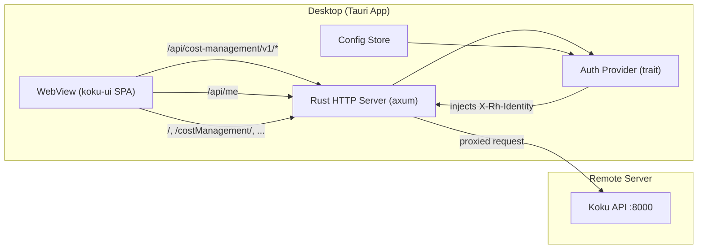

# Koku Desktop Client PoC (Tauri v2)

A Tauri v2 desktop application that bundles the koku-ui on-prem static build and proxies API requests to a remote Koku backend, starting with dev-mode auth (static X-Rh-Identity) and architected to support Keycloak OIDC later.

## Architecture



### Why this design

The koku-ui SPA uses **relative URLs** (`/api/cost-management/v1/...`) hardcoded in axios. Rather than modifying the frontend code, we run a **tiny localhost HTTP server** inside the Tauri process that:

1. **Serves static files** -- the pre-built koku-ui on-prem assets (shell + federated plugins)
2. **Proxies `/api/`** -- forwards API requests to the configured remote Koku server
3. **Injects auth headers** -- adds `X-Rh-Identity` (dev mode) or `Authorization: Bearer` (future OIDC mode)
4. **Mocks `/api/me`** -- returns username/email for the toolbar display

The Tauri webview simply loads `http://localhost:<port>` and the existing koku-ui code works **completely unmodified**.

### Configurable modules

All four UI modules (shell, HCCM, ROS, Sources) are bundled in the `ui/` directory, but the user can toggle which ones are active via config. The Scalprum plugin discovery in the on-prem shell loads plugins from `plugin-manifest.json` files at fixed paths (`/costManagement/`, `/costManagementRos/`, `/sources/`). To disable a module, the proxy server returns **404 for its `plugin-manifest.json`**, which causes `ScalprumComponent` to render its `fallback` (a loading/error state). This means:

- **HCCM** is always loaded (it's the core cost management UI)
- **ROS** and **Sources** are togglable -- when disabled, their manifest requests are blocked and the nav items lead to a graceful fallback
- No koku-ui code changes needed; the proxy controls what manifests are served

---

## Project Structure

```
koku-desktop/
├── src-tauri/
│   ├── Cargo.toml              # Tauri app + deps (axum, reqwest, base64, serde, etc.)
│   ├── tauri.conf.json         # Tauri config (window title, size, devUrl, frontendDist)
│   ├── capabilities/           # Tauri v2 permissions
│   ├── src/
│   │   ├── main.rs             # Entry point: start proxy server, then Tauri app
│   │   ├── proxy.rs            # axum HTTP server: static files + API reverse proxy
│   │   ├── auth/
│   │   │   ├── mod.rs          # AuthProvider trait
│   │   │   ├── dev.rs          # DevAuthProvider: static X-Rh-Identity from config
│   │   │   └── oidc.rs         # (stub) OidcAuthProvider: Keycloak PKCE flow
│   │   └── config.rs           # Server URL, auth mode, identity -- persisted to disk
│   └── icons/                  # App icons
├── settings/                   # Built-in settings page (separate from koku-ui)
│   ├── index.html              # Settings page HTML
│   ├── settings.css            # Minimal PatternFly-inspired styles
│   └── settings.js             # Form logic + Tauri IPC calls to save config
├── about/                      # About window
│   └── index.html              # App version, OS info, server status
├── splash/                     # Splash screen shown during startup
│   └── index.html              # Spinner + status message
├── ui/                         # Pre-built koku-ui static files (gitignored, built separately)
│   ├── index.html              # Shell
│   ├── costManagement/         # HCCM federated plugin
│   ├── costManagementRos/      # ROS federated plugin
│   └── sources/                # Sources federated plugin
├── scripts/
│   └── build-ui.sh             # Script to build koku-ui on-prem and copy dist files here
├── .gitignore
├── README.md
└── Cargo.lock
```

---

## Component Details

### 1. Proxy Server (`proxy.rs`)

An `axum` HTTP server bound to `127.0.0.1:0` (random available port). Three route groups:

- **`GET /api/me`** -- Returns `{"username": "...", "email": "..."}` from the auth provider (decoded from identity config or JWT claims).
- **`/api/*`** -- Reverse proxy using `reqwest`. Strips nothing (path is forwarded as-is to the Koku server). The auth provider injects headers before forwarding. Example: `GET /api/cost-management/v1/sources/` becomes `GET http://<koku-host>:8000/api/cost-management/v1/sources/` with `X-Rh-Identity: <base64>`.
- **Everything else** -- Serves static files from the `ui/` directory. The shell lives at `/`, federated plugins at `/costManagement/`, `/costManagementRos/`, `/sources/`. SPA fallback: any path not matching a file returns `index.html`.

### 2. Auth Provider (`auth/mod.rs`)

A trait with two implementations:

```rust
trait AuthProvider: Send + Sync {
    /// Headers to inject on every proxied API request
    fn request_headers(&self) -> HeaderMap;
    /// User info for /api/me
    fn user_info(&self) -> UserInfo;
}
```

**`DevAuthProvider`** (phase 1):

- Reads identity JSON from config (same format as `DEVELOPMENT_IDENTITY`)
- Base64-encodes it and returns `X-Rh-Identity: <base64>` in `request_headers()`
- Extracts username/email from the identity JSON for `user_info()`
- Requires Koku to run with `DEVELOPMENT=True`

**`OidcAuthProvider`** (future, stubbed now):

- Will perform Keycloak OIDC authorization_code + PKCE via a localhost redirect
- Will store and auto-refresh access/refresh tokens
- Will return `Authorization: Bearer <jwt>` in `request_headers()`
- Will require the Envoy gateway (which converts JWT to X-Rh-Identity)

### 3. Configuration (`config.rs`)

Non-sensitive settings stored as JSON in the platform config directory (`~/.config/koku-desktop/config.json` on Linux). Secrets (CLIENT_SECRET, future OAuth tokens) stored in the **OS keychain** via the `keyring` crate (GNOME Keyring / KDE Wallet on Linux, Keychain on macOS, Credential Manager on Windows).

**Config file** (`~/.config/koku-desktop/config.json`):

```json
{
  "server_url": "http://192.168.1.50:8000",
  "auth_mode": "dev",
  "theme": "system",
  "modules": {
    "ros": true,
    "sources": true
  },
  "oidc": {
    "client_id": "cost-management-desktop"
  },
  "dev_identity": {
    "identity": {
      "account_number": "10001",
      "org_id": "1234567",
      "type": "User",
      "user": {
        "username": "admin",
        "email": "admin@example.com",
        "is_org_admin": true
      }
    },
    "entitlements": {
      "cost_management": { "is_entitled": true }
    }
  }
}
```

**OS keychain** (service name: `koku-desktop`):

| Key | Value | When used |
|-----|-------|-----------|
| `client_secret` | Keycloak CLIENT_SECRET | OIDC auth mode |
| `refresh_token` | OAuth2 refresh token | OIDC auth mode (future) |

- `modules.ros` / `modules.sources`: when `false`, the proxy returns 404 for that module's `plugin-manifest.json`, disabling it in the UI. HCCM is always enabled.
- `theme`: `"light"`, `"dark"`, or `"system"` (follows OS preference via `prefers-color-scheme`). Default: `"system"`.

### 4. Settings Page (`settings/`)

A lightweight, self-contained HTML page (no build tools, no framework -- just plain HTML/CSS/JS) that serves as both the **first-launch setup wizard** and the **settings screen** accessible later.

**Fields:**

- **Server URL** -- text input (e.g. `http://192.168.1.50:8000`), with a "Test Connection" button that hits `GET /api/cost-management/v1/status/` on the target server
- **Auth mode** -- radio: "Development (no Keycloak)" / "Keycloak OIDC (coming soon)" (disabled)
- **Modules** -- checkboxes: "Resource Optimization (ROS)" and "Sources" (both default on)
- **Identity** (shown when auth mode = Development) -- pre-filled with defaults, collapsible "Advanced" section showing the raw JSON for power users
- **Keycloak credentials** (shown when auth mode = OIDC, greyed out in PoC) -- CLIENT_ID text field, CLIENT_SECRET password field. CLIENT_SECRET is saved to the OS keychain, not the config file. A "lock" icon indicates secure storage.

**Integration with Tauri:**

- The settings page calls Tauri IPC commands (`window.__TAURI__.invoke(...)`) to:
  - `get_config` -- load current config on page load
  - `save_config` -- persist config and restart the proxy with new settings
  - `test_connection` -- validate the server URL
- After saving, the webview navigates to `http://127.0.0.1:<port>/` (the koku-ui SPA)

**How it's served:**

- The proxy server serves `/_settings/` from the `settings/` directory (distinct from the koku-ui assets)
- On first launch (no config), the webview opens `/_settings/` instead of `/`
- Later, the File > Settings menu entry or the `/_settings` URL lets users return to it

**Styling:** Minimal PatternFly-inspired CSS (Red Hat colors, clean form layout) to feel consistent with koku-ui, but no PatternFly dependency.

### 5. Tauri Shell (`main.rs`)

Startup sequence:

1. Load config from disk (or detect first launch)
2. Start the axum proxy server on a random localhost port
3. Launch the Tauri webview:
   - If no config exists: navigate to `http://127.0.0.1:<port>/_settings/` (setup wizard)
   - If config exists: navigate to `http://127.0.0.1:<port>/` (koku-ui SPA)
4. Register Tauri IPC commands: `get_config`, `save_config`, `test_connection`, `get_about_info`, `get_server_status`

### 6. File Downloads

The koku-ui export feature generates CSV downloads (e.g., cost reports). In a regular browser, these trigger a native "Save As" dialog. Tauri webviews do **not** handle downloads by default -- they're silently blocked or saved to internal temp paths.

**Solution:** Use Tauri's `on_download` webview hook + the `dialog` plugin to intercept download requests and show a native OS save dialog:

- Default directory: user's `~/Downloads` (via `dirs::download_dir()`)
- Default filename: from the `Content-Disposition` header or URL path
- File type filter: `.csv` (or match the response content type)

This gives users the same save experience as a regular browser. The `tauri-plugin-dialog` crate provides the cross-platform native file dialog.

### 7. Window Menu, Printing, and Navigation Shortcuts

The Tauri app includes a **window menu bar** with standard entries:

- **File > Settings** -- navigates to `/_settings/`
- **File > Print (Ctrl+P / Cmd+P)** -- calls `webview.print()`, which shows the native OS print dialog with full printer selection, page setup, copies, etc. Works on all platforms (WebView2, WKWebView, WebKitGTK).
- **File > Quit (Ctrl+Q / Cmd+Q)** -- exits the app
- **Navigate > Overview (Ctrl+H)** -- `/openshift/cost-management/`
- **Navigate > OpenShift (Ctrl+O)** -- `/openshift/cost-management/ocp`
- **Navigate > AWS** -- `/openshift/cost-management/aws`
- **Navigate > Azure** -- `/openshift/cost-management/azure`
- **Navigate > GCP** -- `/openshift/cost-management/gcp`
- **Navigate > Cost Explorer (Ctrl+E)** -- `/openshift/cost-management/explorer`
- **Navigate > Optimizations** -- `/openshift/cost-management/optimizations` (only if ROS module enabled)
- **Navigate > Settings (Ctrl+Shift+S)** -- `/openshift/cost-management/settings`
- **View > Light Theme / Dark Theme (Ctrl+T)** -- toggles between light and dark mode
- **Help > About** -- opens the About window at `/_about/`

Menu items trigger `webview.eval("window.location.href = '...'")` to navigate the SPA. Cloud provider entries (AWS, Azure, GCP) are included without keyboard shortcuts to keep the shortcut space clean. Optimizations is conditionally shown based on the `modules.ros` config. Keyboard shortcuts are registered as menu accelerators so they work from any page in the app. No koku-ui changes needed.

### 8. UI Build Script (`scripts/build-ui.sh`)

```bash
#!/bin/bash
# Builds koku-ui on-prem and copies dist files to koku-desktop/ui/
KOKU_UI_DIR="${KOKU_UI_DIR:-../koku-ui}"
cd "$KOKU_UI_DIR"
npm ci
npm run build:onprem
# Copy all four dist trees
cp -r apps/koku-ui-onprem/dist/* ../koku-desktop/ui/
cp -r apps/koku-ui-hccm/dist/* ../koku-desktop/ui/costManagement/
# ... etc
```

The `ui/` directory is `.gitignore`d -- users build it from koku-ui source or download a pre-built archive.

### 9. Theme Switching (Light / Dark)

koku-ui uses PatternFly 6, which supports dark mode via a single CSS class (`pf-v6-theme-dark`) on the `<html>` element. The on-prem build does not implement theme toggling -- it always runs in light mode. But the components are dark-theme-ready (charts use CSS custom properties, not hardcoded colors).

The desktop client adds theme support **without modifying koku-ui** by injecting a small inline script into every HTML response served by the proxy:

```javascript
document.documentElement.classList.toggle('pf-v6-theme-dark', __KOKU_DARK_THEME__);
```

The proxy replaces `__KOKU_DARK_THEME__` with `true` or `false` based on the config. This runs before PatternFly renders, so there's no flash of the wrong theme.

**User controls:**

- **View > Dark Theme (Ctrl+T)** in the menu bar -- toggles immediately, persists to config
- **Settings page** -- theme dropdown (Light / Dark / System). "System" follows the OS preference via `prefers-color-scheme`
- The settings page, about page, and splash screen also respect the chosen theme

### 10. About Window

A lightweight HTML page at `/_about/`, accessible via **Help > About** in the menu bar. Displays two sections:

**Desktop Client:**

- Application version (from `Cargo.toml` via `env!("CARGO_PKG_VERSION")`)
- Build commit hash and date (injected at compile time via `build.rs`)
- OS: name, version, architecture (`os_info` crate)
- Tauri version (`tauri::VERSION`)
- Webview engine and version

**Connected Server:**

- Server URL (from config)
- Auth mode (dev / OIDC)
- Enabled modules (HCCM, ROS, Sources)
- Cost Management version, commit, Python version, platform, database -- all from `GET /api/cost-management/v1/status/` (the Koku status endpoint returns this as JSON)
- Connection status (reachable / unreachable, with latency)

The page calls two Tauri IPC commands on load:

- `get_about_info` -- returns local app/OS info (synchronous, instant)
- `get_server_status` -- proxies the Koku status endpoint (async, may fail if server is down -- shows "Unreachable" gracefully)

Styled consistently with the settings page (same PatternFly-inspired CSS).

### 11. Platform Integrations

**Window state persistence** (`tauri-plugin-window-state`):
Remembers window size, position, and maximized state across launches. Persists to disk automatically. Users open the app and it's exactly where they left it.

**External link handling** (`tauri-plugin-opener`):
koku-ui contains links to `docs.redhat.com` and other external sites. Without handling, clicking these navigates the webview away from the app (with no back button). The opener plugin intercepts navigation to external URLs and opens them in the user's default browser instead.

**Logging** (`tauri-plugin-log`):
Structured logging to rotating log files at `~/.config/koku-desktop/logs/`. Captures proxy server activity, connection errors, auth failures, and config changes. Essential for debugging "I can't connect" support issues. Log levels configurable in settings.

**System tray**:
Minimizes to a system tray icon instead of fully closing. Tray menu includes:

- "Open Cost Management" -- restore the window
- "Settings" -- open settings page
- "Quit" -- fully exit

The window close button minimizes to tray; Quit (Ctrl+Q) or the tray menu exits the app. This makes sense for a tool users may leave running while they work.

**Splash screen**:
A minimal HTML splash page (`splash/index.html`) shown in a small borderless window while the proxy server starts and validates the connection. Displays the app name, a spinner, and a status message ("Starting proxy server...", "Connecting to server...", "Loading UI..."). The splash window closes and the main window opens once the SPA is ready. Handles slow server connections gracefully with a timeout message.

**Auto-updater** (architecture only, `tauri-plugin-updater`):
Stubbed in the PoC -- the config and Tauri plugin setup will be in place, but no update server is configured. The architecture supports checking a URL (GitHub Releases or a custom endpoint) on launch for new versions, downloading, and replacing the binary. This addresses the version-skew concern (old desktop client vs updated backend). Full implementation deferred to when a release/distribution pipeline exists.

---

## What Stays Unmodified

- **koku-ui source code**: Zero changes. The static build is used as-is.
- **koku backend**: Zero changes. It already supports `DEVELOPMENT=True` with `DEVELOPMENT_IDENTITY`.
- **Existing on-prem deployment**: Unaffected. The desktop client is an alternative access method, not a replacement.

---

## Key Dependencies (Rust)

- `tauri` v2 -- desktop app framework
- `tauri-plugin-dialog` -- native OS file save dialog (for CSV export downloads)
- `tauri-plugin-window-state` -- persist window size/position
- `tauri-plugin-opener` -- open external links in default browser
- `tauri-plugin-log` -- structured rotating log files
- `tauri-plugin-updater` -- auto-update support (stubbed)
- `axum` -- HTTP server for proxy + static file serving
- `reqwest` -- HTTP client for proxying to Koku
- `tower-http` -- Static file serving middleware for axum
- `serde` / `serde_json` -- Config serialization
- `base64` -- X-Rh-Identity encoding
- `keyring` -- cross-platform OS keychain access (GNOME Keyring, macOS Keychain, Windows Credential Manager)
- `os_info` -- OS name, version, architecture for the About window
- `dirs` -- platform-standard directory paths (Downloads, config)
- `tokio` -- Async runtime

---

## Future: Adding Keycloak OIDC (Phase 2, not in this PoC)

The `OidcAuthProvider` would:

1. Open a browser/webview for Keycloak login (authorization_code + PKCE)
2. Listen on a localhost callback URL for the auth code
3. Exchange code for access + refresh tokens
4. Auto-refresh tokens before expiry
5. Point at the **gateway** URL instead of Koku directly (gateway validates JWT)

The proxy server, static file serving, and `/api/me` mock all remain the same -- only the auth header injection changes. This is why the `AuthProvider` trait exists.
